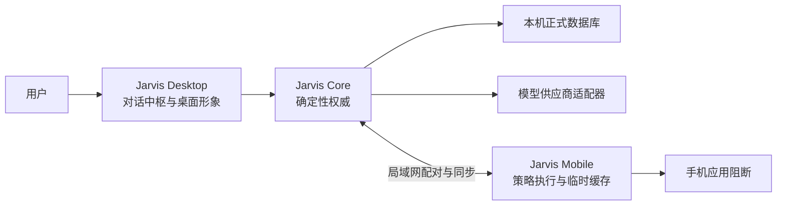

# Jarvis 第二版开发手册

> 状态：已确认需求基线，2026-08-26。V2-A 的手机实现仍受 Mate 70 Pro+ / HarmonyOS 4.3 真机技术验证约束；公开资料只支持“尽力型覆盖阻断”，不支持普通应用拥有系统级暂停其他应用的结论。本文是第二版实施权威；`supervision-spec.md`、`companion-spec.md` 与 `growth-and-knowledge-spec.md` 继续保存第一版完整基线，冲突时以本文明确写出的 V2 变更为准。

## 1. 第二版要解决的问题

第一版已经形成可靠但入口较多的监督后台。第二版把用户学习成本降到最低：用户主要面对一个对话中枢，用自然语言记录想法、安排提醒或提前布置监督；Jarvis 把自然语言转换为可解释的正式操作，并在工作承诺期间让电脑轻监督和手机强阻断协同工作。

第二版的产品主干是：

> **一个对话入口 + 记录/提醒/监督三种用户意图 + 简化模板 + 电脑轻监督 + 华为手机强阻断 + 每日/每周复盘。**

### 1.1 首要使用场景

用户在电脑对话中说：“今天下午两点做两小时交易复盘，认真监督我。”Jarvis 匹配交易复盘模板，展示时间、TradingView/Notion、默认被动型监督和手机阻断摘要。用户确认后，工作承诺按时生效，手机阻断抖音、B站、小红书和手机微信；电脑依据非内容活动证据进行轻监督。结束后解除阻断，并通过同一聊天窗口完成承诺回顾。

### 1.2 产品原则

1. **对话优先，但不是纯文本。** 结构化卡片负责确认和纠错，设置只是次级入口。
2. **先简化，后扩展。** 不为尚未确认的多用户、公开分发、跨平台或复杂自动化建设基础设施。
3. **正式监督必须提前确认。** 记录和提醒不能被 AI 静默升级为工作承诺。
4. **确定性核心拥有最终写入权。** AI 只能提交候选操作，不能直接修改规则、事实或后果。
5. **电脑轻监督，手机强阻断。** 电脑以提醒为主；手机只在工作承诺期间阻断明确指定的分心应用。
6. **事实与内容分离。** 监督使用有限非内容证据；聊天、想法和复盘正文不能独立触发偏离或加强监督。
7. **故障必须可见。** 权限、连接或阻断失败时进入监督降级，不能伪装成完整监督。
8. **陪伴没有情感债。** 语气可以严肃、俏皮或撒娇，但不羞辱、不操纵，也不改变监督规则。

## 2. 权威边界与版本关系

- `CONTEXT.md` 定义统一领域语言。
- 本文定义第二版范围、行为、里程碑和验收。
- `requirements-discovery.md` 保存完整访谈台账和 V2 检查点。
- 第一版三份规格继续作为未被本文修改的行为基线，尤其是三态活动分类、承诺版本、返回意图、偏离计时、回顾原文和确定性核心。
- 手机技术研究只证明实现可行性，不能自行扩大已确认权限或改变产品行为。
- 若真机证明目标阻断方式不可行，V2-A 必须停在技术门禁并重新确认降级方案，不能以普通通知冒充已经实现应用阻断。

## 3. 用户可见的三种意图

### 3.1 记录

记录用于保存没有必需执行时间的想法、灵感和普通笔记。

- 文字输入直接保存并显示“已记录”，支持立即撤销。
- 主动语音先转写，用户确认或修改文字后保存。
- 始终保留原始表达；AI 标题、标签、关联和完善内容是可编辑派生信息。
- 记录不会自动获得提醒时间，不会自动转成工作承诺。
- 第二版只建设一个记录库，不建设“想法箱 → 长期记忆”的第二套晋升流程。

### 3.2 提醒

提醒事项有指定时间和处理结果，但没有活动监督与手机阻断权。

- Jarvis 从自然语言提取内容和时间，直接创建后显示紧凑摘要和撤销入口；存在时间歧义时先追问。
- 状态只需支持 `待处理 / 已完成 / 已推迟 / 已取消`。
- 到期时同时触发桌面反馈和手机通知；30 分钟仍未处理时再提醒一次。
- 第二次提醒后不继续轰炸，只保留持续可见且不闪烁的待处理状态。
- 推迟必须给出新时间，原因可选；取消或日终仍未完成时必须保存用户的原始原因。
- 没有回应只记为未回应，不能自动判定用户失败。

### 3.3 监督

“监督”是聊天界面对正式 `工作承诺` 的简写。

- 只有用户主动表达监督意图，或明确接受 Jarvis 的监督建议，才生成承诺草稿。
- 草稿必须通过承诺卡片确认后成立。
- 工作承诺生效后才允许电脑活动判断、偏离提醒和手机应用阻断。
- 同一时间仍只允许一个电脑型工作承诺自动监督。
- 计划结束只停止监督，不自动表示成果完成。

## 4. 对话中枢

### 4.1 页面结构

- 桌面端只有一个主要对话窗口；桌面形象单击后打开该窗口。
- 普通消息、结构化结果、确认卡、提醒状态、监督回应和复盘都出现在同一会话流。
- 设置、历史、权限和数据管理从会话窗口进入次级页面，不在首页并列多个功能中心。
- 卡片默认只显示完成决定所需的最少字段，其他信息折叠在“查看详情”中。

### 4.2 操作风险分级

| 操作 | 默认行为 |
|---|---|
| 保存记录、完成提醒、查询状态 | 直接执行，显示结果并允许撤销 |
| 创建时间明确的普通提醒 | 直接执行，显示时间摘要并允许修改 |
| 创建或修订工作承诺 | 必须展示承诺卡片并确认 |
| 启用或改变手机应用阻断 | 必须随工作承诺或修订一起确认 |
| 加强下一周期监督 | 展示证据和单项建议，确认后生效 |
| 删除长期数据、扩大云端资料范围 | 单独明确确认 |

### 4.3 AI 与核心的接口

AI 只能提交带原始用户表达的候选操作，例如：

- `CreateRecordCandidate`
- `CreateReminderCandidate`
- `DraftWorkCommitmentCandidate`
- `ReviseWorkCommitmentCandidate`
- `UpdateTemplateCandidate`
- `SummarizeReviewCandidate`
- `SuggestSupervisionChangeCandidate`

`Jarvis Core` 校验对象类型、必填字段、时间、模板作用域、承诺版本、权限和确认状态后才写入正式数据。模型失败、费用封顶或被关闭时，记录、提醒、模板、监督和手机策略继续通过简化卡片或表单工作。

## 5. 简化承诺模板

模板只保存：

- 常用目标描述；
- 默认持续时间；
- 相关电脑应用或网站；
- 被动型或交互型监督模式；
- 手机阻断应用；
- 电脑提醒阈值。

模板不保存角色语气、复杂步骤、复盘问卷、具体执行日期或自动学习规则。Jarvis 可以从自然语言匹配模板并填充草稿，但临时修改不反向更新模板；只有用户明确表达“以后都这样”并确认更新摘要后，模板才产生新版本。

### 5.1 交易复盘模板基线

- 目标：交易复盘，具体成果由本次承诺卡补充。
- 默认模式：被动型。
- 相关电脑应用：TradingView、Notion。
- 默认手机阻断：抖音、B站、小红书、手机微信。
- 手机微信受阻断，电脑微信不受影响。
- 第二版不读取或修改 TradingView、Notion 内容，也不接入二者 API。

## 6. 电脑监督

### 6.1 证据与分类

- 使用键鼠活跃/空闲、前台应用和浏览器域名等非内容信号。
- 默认不保存或使用具体按键、剪贴板、聊天正文、网页正文、截图或录屏。
- 活动仍分为 `相关 / 分心 / 未确定`；未确定先询问，不能直接视为违约。
- 用户纠正活动分类时保留原决定和纠正结果，不能覆盖历史。

### 6.2 监督模式

- 只保留被动型和交互型，不建设混合型或自动阶段切换。
- 默认被动型：相关应用或网站保持前台时，不因键鼠空闲进入偏离。
- 交互型：持续空闲可以按第一版规则询问是否休息或偏离，但空闲不能证明成果未完成。
- 每个模板或单次工作承诺可以明确选择交互型；没有选择时使用被动型。

### 6.3 沿用的监督时序

除本文明确改变的手机渠道外，第二版继续沿用第一版时序：

- 预定工作承诺到点自动生效，不要求再次点击开始；默认有 5 分钟准备缓冲。
- 明确分心连续约 5 分钟后进行一次本机轻提醒。
- 连续偏离达到 20 分钟后，通过专用手机端发送第一次监督提醒；仍未恢复时每隔 20 分钟再次提醒，同一 episode 最多 3 条。
- “马上回去”只记录返回意图；只有稳定相关活动、确认相关、限时休息、承诺修订或结束才能改变偏离状态。
- 关闭气泡或忽略手机消息不能重置计时。

## 7. 华为手机监督端

### 7.1 目标与范围

- 唯一验收设备：HUAWEI Mate 70 Pro+，型号 PLA-AL10，HarmonyOS 4.3.0。
- 私人签名 APK 手动安装，不上架应用市场，不建设账号、多用户和通用机型兼容；后续更新必须保持同一包名和签名。
- V2 专用手机端替代飞书监督入口。
- 手机端不建设完整设置、历史管理、独立复盘或离线 AI。
- HarmonyOS 5 / NEXT 不在兼容范围；系统升级前必须提示需要重新验证。

[HarmonyOS 4.3 手机监督端可行性研究](../research/huawei-mate70pro-plus-harmonyos43-supervision-feasibility.md)确认：普通非 root、非 Device Owner、非企业 MDM 应用没有官方系统级暂停任意其他包的权限。V2-A 的候选实现是 `UsageStatsManager` 前台识别、`TYPE_APPLICATION_OVERLAY` 全屏覆盖、可见前台服务、本地 alarm 与离线策略缓存的组合；该组合必须通过目标真机 spike，产品只能称为“尽力型应用阻断”。无障碍服务只作为受控对照原型，不读取界面内容，也不在验证前成为正式架构。

### 7.2 最小界面

手机端只提供：

- 最近的 Jarvis 消息与当前监督状态；
- 普通提醒和监督回应；
- 快速文字记录与主动语音入口；
- 当前被阻断应用列表；
- 临时开放申请；
- 连接、权限和执行状态。

电脑在线时处理自然语言和正式操作。手机离线输入先排队，恢复连接后提交；离线期间不能在手机上新建或修改正式工作承诺。

### 7.3 应用阻断

- 手机监测和阻断只在已确认工作承诺的有效时间内运行，并持续显示监督状态。
- 产品目标是承诺生效后在用户完成有效交互前识别并覆盖抖音、B站、小红书和手机微信，不等待累计使用 5 分钟；真机 spike 通过前不能表述为系统级禁用或不可绕过。
- 只阻断名单内应用，不锁整台手机；电话、短信、支付、验证、地图和系统必要能力不受该策略影响。
- 应用切换和使用时长可以作为监督事件记录，但只保存包标识和时间，不读取应用内容；四个目标应用及应用分身的实际包名必须从目标真机核验，不能凭记忆写死。
- 到工作承诺原定结束时间必须自动解除；手机不得自行延长或加强策略。

### 7.4 临时开放

- 用户必须输入原始原因后才能申请。
- 每次只开放 5 分钟，到期自动重新阻断。
- 记录申请时间、目标应用、开始与结束时间及原始原因，不记录应用内容。
- 临时开放不修改模板或永久阻断名单，并进入承诺回顾和每周复盘。

### 7.5 离线与降级

- 手机保存最后一个已经确认且仍有效的工作承诺策略，可以在电脑断线后独立执行到原定结束时间。
- 离线期间不接受电脑的新策略；恢复连接后按承诺 ID 和版本同步尚未确认的手机事件。
- 电脑与手机优先在同一局域网通过已配对、加密且可撤销的连接通信；具体协议以最小原型为准，不建设项目云端后端。
- 手机离线、权限失效、后台服务被终止或阻断失败时，电脑工作承诺仍按时开始，但进入可见的监督降级。
- 降级状态立即提示并尝试恢复；恢复后若承诺仍有效，执行剩余时段策略。
- 技术故障只记录为监督不可用，不能自动归类为用户逃避。

### 7.6 技术门禁

以下能力在真机原型通过前一律标记为“需验证”：

- 可靠识别名单应用进入前台；
- 在普通私人安装和已授权权限下阻止目标应用进入；
- 重启、锁屏、网络切换和系统省电后的后台存活与恢复；
- 权限撤销和被系统终止的可靠检测；
- 五分钟临时开放到期后的自动恢复；
- 同局域网配对、策略同步、离线事件补传和重复事件去重。

若上述核心阻断能力无法通过，不得将普通通知或覆盖层提示写成“应用阻断已完成”。

最小 spike 依次验证：设备/API 探针与签名升级、`UsageStatsManager` 和无障碍事件的前台识别对照、首选普通全屏 overlay 与无障碍 overlay/Home 的阻断对照，以及断网、息屏、清后台、省电和重启下的生命周期。只有首选路径通过时才删除无障碍对照；若首选失败而必须依赖无障碍，需重新确认用途边界和维护风险。

## 8. 记录与活动事实账本

### 8.1 记录库

- 所有想法和普通笔记进入同一个记录库。
- 原始文字或确认后的语音转写长期保留，直到用户删除。
- AI 可以生成标题、标签、关联旧记录和完善版本，所有派生内容可编辑并标明来源。
- 记录可以由用户明确转成提醒或工作承诺草稿；AI 不得自动转换。

### 8.2 活动事实账本

- V2-B 经一次明确授权后，可以在没有工作承诺时继续记录电脑应用、浏览器域名、活跃/空闲和时间。
- 原始时间线只保存在本机，默认保留 30 天，之后只保留每日汇总。
- 复盘可以说“可能在 TradingView 和 Notion 投入约两小时”，不能据此宣称交易复盘完成。
- 账本不形成输入日志、窗口正文、聊天正文、截图、录屏或可回放屏幕历史。
- 用户可以随时暂停全天记录；暂停不影响已经确认工作承诺期间所需的活动证据。

## 9. 回顾、每日复盘与每周复盘

### 9.1 承诺回顾

- 工作承诺结束后在对话中枢邀请用户回顾。
- 用户可以立即回顾、稍后回顾或明确跳过；未回应进入待回顾。
- 保存原始表达，AI 可以整理完成、部分完成或未完成等候选结果，但用户可以纠正。
- 临时开放、手机监督降级、电脑偏离和提醒回应作为事实展示，不自动产生道德评价。

### 9.2 每日复盘

- 默认用 5—10 分钟对话整理当天的工作承诺、提醒结果、活动事实、记录和主观感受。
- 先给事实草稿，再补充原因、做得好的地方、不理想之处和次日少量行动。
- 取消或日终仍未完成的提醒必须补充原始原因；未回应不能由 AI 编造原因。
- 正式复盘结论由用户确认后保存。

### 9.3 每周复盘

- 默认用 20—30 分钟回顾每日复盘和监督记录。
- 识别反复分心、未完成原因、有效工作方式、成果和下周重点。
- Jarvis 每周最多提出一项监督规则调整，展示支持证据。
- 调整只有确认后才生效，并提供简单撤销；不建设独立实验管理系统。

## 10. 语气与语音

### 10.1 语气

- 只提供一个全局默认语气，可以选择严肃、俏皮、撒娇或自然混合。
- 用户可以用自然语言临时要求本次更换语气，属于低风险操作，可以直接执行并显示结果。
- 语气不写入模板，不改变事实、提醒阈值、应用阻断或用户控制权。
- 严肃不羞辱，撒娇不制造情感债，忽略角色不产生惩罚。

### 10.2 主动语音

- V2-B 在电脑和手机提供主动按下后说话，不持续监听唤醒词。
- 语音先转写为可检查文字；记录可以确认后保存，提醒和工作承诺按各自风险规则处理。
- 默认不长期保存原始录音，只保存确认后的文字。
- 可能启动监督、修改承诺或应用阻断时仍需结构化确认卡。

## 11. 架构边界

- `Jarvis Core` 继续拥有工作承诺、提醒、模板、正式记录和监督状态的写入权。
- `Jarvis Desktop` 负责对话中枢、结构化卡片、桌面形象和本机交互投影。
- `Jarvis Mobile` 只执行已确认策略并产生带唯一标识的回应或监督事件，不成为第二个业务权威。
- 正式长期数据仍以 Windows 本机数据库为准；手机只保留执行所需策略和待同步事件。
- 项目不建设云端业务后端、账号系统或多设备同步服务。
- AI 请求使用当前问题所需的最少上下文；默认不发送全天活动时间线、全部聊天或完整记录库。界面应允许查看本次使用的相关记录。

## 12. 数据保留与用户权利

| 数据 | 默认期限与处理 |
|---|---|
| 原始电脑活动事实 | 本机 30 天，之后只保留每日汇总 |
| 工作承诺、修订、监督事件与回顾 | 长期保留，直到用户删除 |
| 记录、提醒与原始原因 | 长期保留，直到用户删除 |
| 手机阻断和临时开放 | 长期保存时间、应用类别和原因，不保存应用内容 |
| 原始语音 | 转写确认后删除，不长期保存 |
| 云端 AI 请求记录 | 保存供应商、模型、用途、费用和引用记录，不复制完整私人提示词 |

用户可以按类别和日期查看、导出和永久删除数据。手机配对撤销后删除手机上的有效策略和待同步私人数据；具体重试与清理期限在真机原型中验证，不额外建设复杂保留层级。

## 13. 交付里程碑

### 13.1 V2-A：核心闭环

- 桌面对话中枢与结构化卡片；
- 记录、提醒、监督三种意图；
- 简化模板；
- 被动型默认、交互型可选的电脑监督；
- 华为手机私人安装、配对、应用阻断、临时开放与离线策略执行；
- 手机监督降级与恢复；
- 承诺回顾；
- 文字想法记录。

### 13.2 V2-B：记录与复盘增强

- 电脑和手机主动语音；
- 全天粗粒度活动事实账本；
- 每日复盘与每周复盘；
- 记录关联和 AI 完善；
- 下一周期最多一项监督调整建议。

V2-A 完整验收前不进入 V2-B。V2-B 不得反向扩大 V2-A 的活动证据或手机权限。

## 14. V2-A 端到端验收

交易复盘场景必须通过以下完整流程：

1. 在桌面对话中输入“今天下午两点做两小时交易复盘，认真监督我”。
2. Jarvis 匹配交易复盘模板，并展示包含目标、时间、TradingView/Notion、被动型和手机阻断摘要的确认卡。
3. 用户确认后写入工作承诺，并把带版本和结束时间的策略同步到目标手机。
4. 到 14:00 工作承诺自动生效，手机立即阻断抖音、B站、小红书和手机微信。
5. TradingView 或 Notion 保持前台时，电脑不因被动观察和空闲提醒。
6. 明确分心电脑活动按既有 5/20 分钟规则提醒，相关或未确定活动不被错误宣判。
7. 用户在手机申请临时开放，未填写原因时不能继续；填写后仅开放 5 分钟，到期恢复阻断。
8. 电脑断网后，手机继续执行既有策略，但不能接收或制造更强规则。
9. 到 16:00 手机自动解除阻断，电脑停止监督并在同一对话中发起承诺回顾。
10. 回顾展示电脑监督、手机阻断、临时开放和降级事实，保存用户原始表达，不自动宣判成果。

### 14.1 故障验收

- AI 不可用：通过模板和卡片仍能创建、确认和执行工作承诺。
- 手机未连接：电脑按时开始并显示监督降级，不声称手机已阻断。
- 手机在有效承诺内恢复：只执行剩余时段策略，不补锁已经过去的时间。
- 手机重启或权限撤销：明确检测并报告；无法证明阻断时保持降级。
- 重复同步：不能重复创建策略、临时开放或监督事件。
- 旧承诺版本：不能覆盖当前有效版本或延长阻断时间。
- 结束时间到达：无论电脑是否在线，手机都必须尝试解除阻断并展示真实结果。

### 14.2 手机 spike 的量化门槛

- 完成签名 APK 首装与同签名覆盖升级，安装引导能逐项显示使用情况访问、悬浮窗、通知、后台活动和定时能力状态。
- `UsageStatsManager` 路径在 100 次前台切换中无目标应用漏报，并记录 P50、P95 和最大事件延迟。
- 四个目标应用分别从桌面、通知、深链和最近任务启动至少 25 次，每次都在用户完成有效交互前出现阻断层。
- Windows 断网或关机后继续执行已确认策略；原定结束后 10 秒内解除，不等待电脑消息。
- 完成 8 小时息屏、网络切换和内存压力测试，如实记录后台被杀、事件漏报和额外耗电。
- 任一目标应用存在普通使用路径下稳定可复现的绕过、检测长期晚于有效交互，或必须读取正文/截图/输入才能识别时，V2-A 手机门禁失败。
- 若必须 root、解锁 bootloader、Device Owner、企业 MDM、整机锁定或只能依赖 HarmonyOS 5 能力，当前方案失败并返回产品决策，不扩大权限绕过门禁。

## 15. 明确不做

- 公开应用市场发布、多账号、多用户、iPhone 或其他 Android/HarmonyOS 机型兼容。
- HarmonyOS 5 / NEXT 兼容、root、解锁 bootloader、Device Owner、企业 MDM 或整机锁定。
- 项目自建云端业务后端和完整跨设备历史同步。
- 飞书与专用手机端两套 V2 监督渠道并行维护。
- 锁整台手机、阻断电话/支付/验证/地图等必要能力。
- 手机先累计使用 5 分钟再阻断；V2 使用承诺期间立即阻断。
- 手机端完整设置、独立复盘、完整历史管理或离线 AI。
- 混合型监督模式、应用阶段自动切换和复杂工作流编排。
- 重型待办系统、复杂原因分类、自动学习模板和独立实验管理系统。
- 无限通知轰炸、自动加强监督、伙伴密码、金钱惩罚或联系人羞辱。
- TradingView/Notion API 集成、双向同步或自动修改外部资料。
- 依据应用时长自动宣布任务完成。
- 把聊天正文、输入、截图、录屏、网页正文或长期屏幕历史用作监督证据。
- 为第二版迁移到 Electron、Live2D、VRM 或重型 3D 渲染栈。

## 16. 开发顺序与门禁

1. **手机可行性原型**：先在目标真机验证前台识别、应用阻断、权限、后台恢复、临时开放和到期解除；失败时停止手机正式实现并重新决策。
2. **对话中枢垂直切片**：自然语言 → 候选操作 → 结构化卡片 → 核心确认 → 正式数据，先覆盖记录、提醒和交易复盘承诺。
3. **模板与电脑监督接入**：沿用现有确定性状态机，默认切到被动型并验证 V1 行为未回归。
4. **手机配对与策略同步**：只实现一个电脑和一个目标手机，无云端、无账号。
5. **端到端交易复盘验收**：通过第 14 节全部正常和故障场景后，完成 V2-A。
6. **V2-B 增强**：按主动语音、活动事实账本、每日复盘、每周复盘、记录关联与单项监督建议的顺序增量交付。

每一步只引入完成当前门禁所需的模块。未经重新确认，不为多用户、公开分发、复杂同步或未来插件预建抽象。
